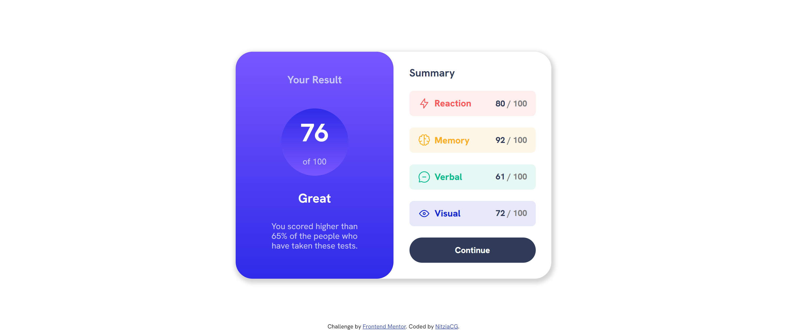
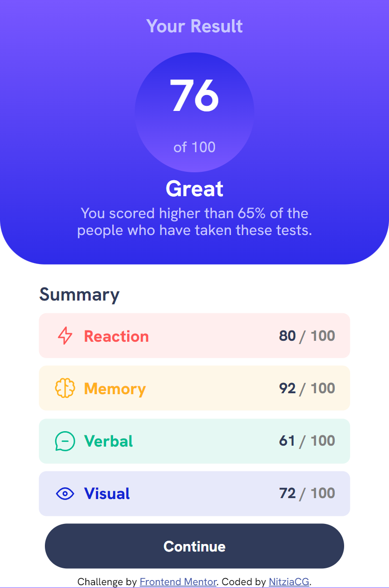

## Table of contents

- [The challenge](#the-challenge)
- [Screenshot](#screenshot)
- [Tools](#built-with)
- [Author](#author)
- [Links](#links)

### The challenge

Users should be able to:

- View the optimal layout for the interface depending on their device's screen size
- See hover and focus states for all interactive elements on the page
- **Bonus**: Use the local JSON data to dynamically populate the content

### Screenshot
#### Desktop design

#### Mobile design

### Built with

- Semantic HTML5 markup
- CSS custom properties
- Flexbox
- JSON
- JS

## Author
- Guthub - [@NitziaCG](https://github.com/NitziaCG/Frontend-Mentor-Projects)
- My user: [@NitziaCG](https://www.frontendmentor.io/profile/NitziaCG)

## Links
- Frontend Mentor: [Challenge](https://www.frontendmentor.io?ref=challenge)

