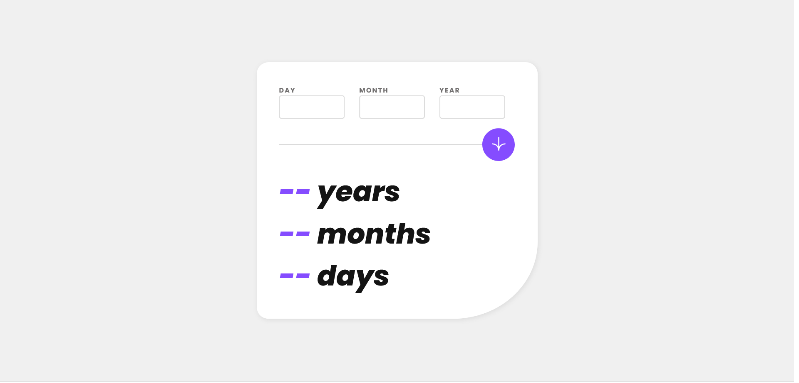

# Frontend Mentor - Age calculator app solution

This is a solution to the [Age calculator app challenge on Frontend Mentor](https://www.frontendmentor.io/challenges/age-calculator-app-dF9DFFpj-Q). Frontend Mentor challenges help you improve your coding skills by building realistic projects. 

## Table of contents

- [Overview](#overview)
  - [The challenge](#the-challenge)
  - [Screenshot](#screenshot)
  - [Links](#links)
- [My process](#my-process)
  - [Built with](#built-with)
  - [Continued development](#continued-development)
  - [Useful resources](#useful-resources)
- [Author](#author)

## Overview

### The challenge

Users should be able to:

- View an age in years, months, and days after submitting a valid date through the form
- Receive validation errors if:
  - Any field is empty when the form is submitted
  - The day number is not between 1-31
  - The month number is not between 1-12
  - The year is in the future
  - The date is invalid e.g. 31/04/1991 (there are 30 days in April)
- View the optimal layout for the interface depending on their device's screen size
- See hover and focus states for all interactive elements on the page
- **Bonus**: See the age numbers animate to their final number when the form is submitted

### Screenshot

This is a solution to the [Age Calculator App](https://www.frontendmentor.io/challenges/age-calculator-app-dF9DFFpj-Q). Frontend Mentor challenges help you improve your coding skills by building realistic projects. 

Mobile Screenshot

Desktop Screenshot

### Links

- Solution URL: [Github Repository](https://github.com/NitziaCG/Frontend-Mentor-Projects/tree/main/age-calculator-app-main)
- Live Site URL: [https://65862b6b1eb6073564c8b35b--hilarious-quokka-4a2bbf.netlify.app/](https://65862b6b1eb6073564c8b35b--hilarious-quokka-4a2bbf.netlify.app/)

## My process

### Built with

- Semantic HTML5 markup
- CSS custom properties
- Flexbox
- Mobile-first workflow

### Continued development

I'll continue learning about frontend web development

### Useful resources

- [CSS Tricks](https://css-tricks.com/)
- [MDN](https://developer.mozilla.org/en-US/docs/Web/CSS/grid)
- [W3SCHOOLS](https://www.w3schools.com/css/default.asp)

## Author

- Frontend Mentor - [@NitziaCG](https://www.frontendmentor.io/profile/NitziaCG)
- GitHub - [@NitziaCG](https://github.com/NitziaCG/)

