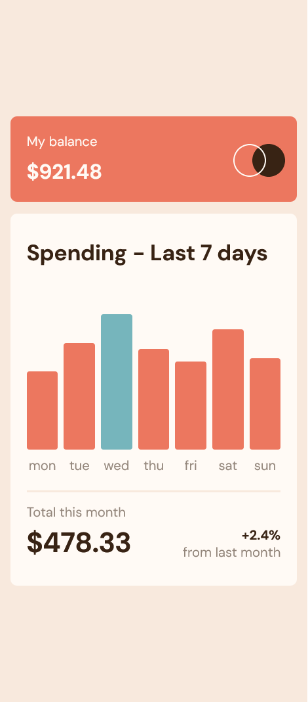
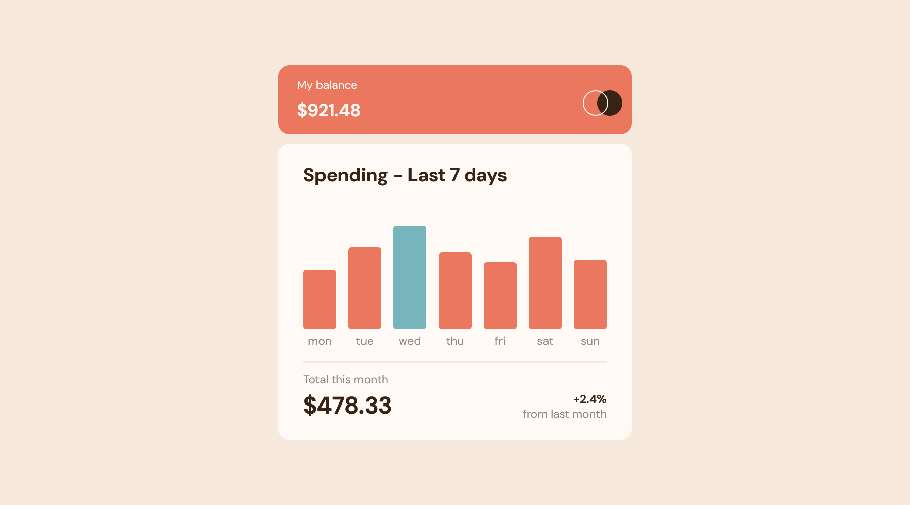

# Frontend Mentor - Expenses chart component solution

This is a solution to the [Expenses chart component challenge on Frontend Mentor](https://www.frontendmentor.io/challenges/expenses-chart-component-e7yJBUdjwt). Frontend Mentor challenges help you improve your coding skills by building realistic projects. 

## Table of contents

- [Frontend Mentor - Expenses chart component solution](#frontend-mentor---expenses-chart-component-solution)
  - [Table of contents](#table-of-contents)
  - [Overview](#overview)
    - [The challenge](#the-challenge)
    - [Screenshots](#screenshots)
    - [Links](#links)
  - [My process](#my-process)
    - [Built with](#built-with)
    - [Continued development](#continued-development)
    - [Useful resources](#useful-resources)
  - [Author](#author)

## Overview

### The challenge

Users should be able to:

- View the bar chart and hover over the individual bars to see the correct amounts for each day
- See the current day’s bar highlighted in a different colour to the other bars
- View the optimal layout for the content depending on their device’s screen size
- See hover states for all interactive elements on the page
- **Bonus**: Use the JSON data file provided to dynamically size the bars on the chart

### Screenshots

<section style="display:flex; gap: 30px; flex-wrap:wrap">
  

    <h3>Mobile screenshot</h3>
    
  

  

    <h3>Desktop screenshot</h3>
    
  

</section>

### Links

- Solution URL: [Github Repository](https://github.com/NitziaCG/Frontend-Mentor-Projects/tree/main/expenses-chart-component-main)
- Live Site URL: [Add live site URL here](https://your-live-site-url.com)

## My process

### Built with

- Javascript
- Semantic HTML5 markup
- CSS custom properties
- Flexbox
- Mobile-first workflow

### Continued development

I'll continue learning about frontend web development.

### Useful resources

- [CSS Tricks](https://css-tricks.com/)
- [CSS Reference](https://cssreference.io/)
- [HTML Reference](https://htmlreference.io/)
- [W3SCHOOLS](https://www.w3schools.com/css/default.asp)
- [MDN](https://developer.mozilla.org/en-US/docs/Web/CSS/grid)

## Author

- Frontend Mentor - [@NitziaCG](https://www.frontendmentor.io/profile/NitziaCG)
- GitHub - [@NitziaCG](https://github.com/NitziaCG/)

