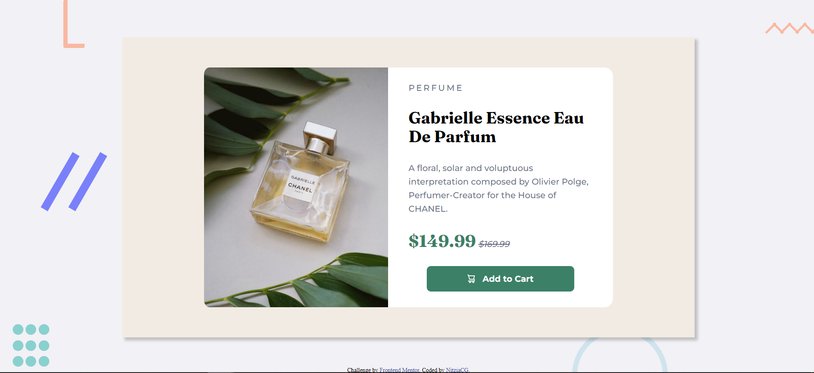

# Frontend Mentor - Product preview card component solution

This is a solution to the [Product preview card component challenge on Frontend Mentor](https://www.frontendmentor.io/challenges/product-preview-card-component-GO7UmttRfa). Frontend Mentor challenges help you improve your coding skills by building realistic projects. 

## Table of contents

- [Overview](#overview)
  - [The challenge](#the-challenge)
  - [Screenshot](#screenshot)
  - [Links](#links)
- [My process](#my-process)
  - [Built with](#built-with)
  - [What I learned](#what-i-learned)
  - [Continued development](#continued-development)
- [Author](#author)

## Overview

### The challenge

Users should be able to:

- View the optimal layout depending on their device's screen size
- See hover and focus states for interactive elements

### Screenshot




### Links

- Solution URL: [Add solution URL here](https://your-solution-url.com)
- Live Site URL: [Add live site URL here](https://your-live-site-url.com)

## My process

### Built with

- Semantic HTML5 markup
- CSS custom properties
- Flexbox
- CSS Grid


### What I learned

Things i have learned or improved:
- Responsive layouts using flexbox
- Simple transitions in CSS
- Use clamp() function to make responsive text and boxes
- min() and max() functions
- Have fun

```html
<button class="product-char__add">Some HTML code I'm proud of</button>
```
```css
.product-char__add {
  transition: transform 3s, background 3s;
}

.product-char__add:hover {
    transform: translateY(-3px);
    background-color: rgb(60, 107, 94);
    cursor: pointer;
}
```

### Continued development
Continue practicing CSS for later learn JS :D


## Author

- Frontend Mentor - [@NitziaCG](https://www.frontendmentor.io/profile/NitziaCG)
