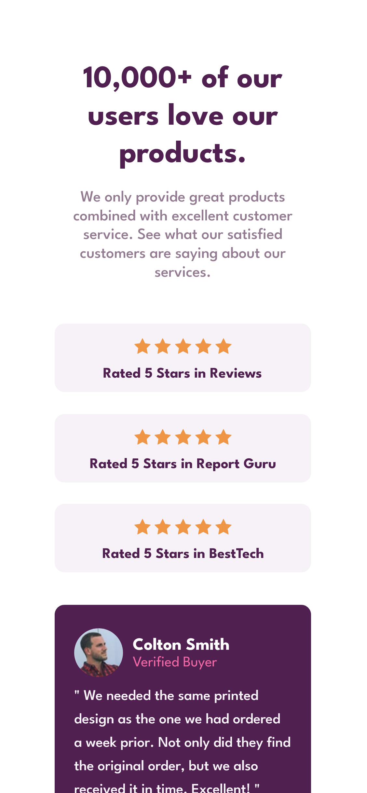
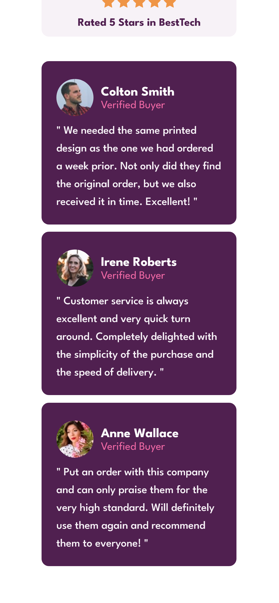
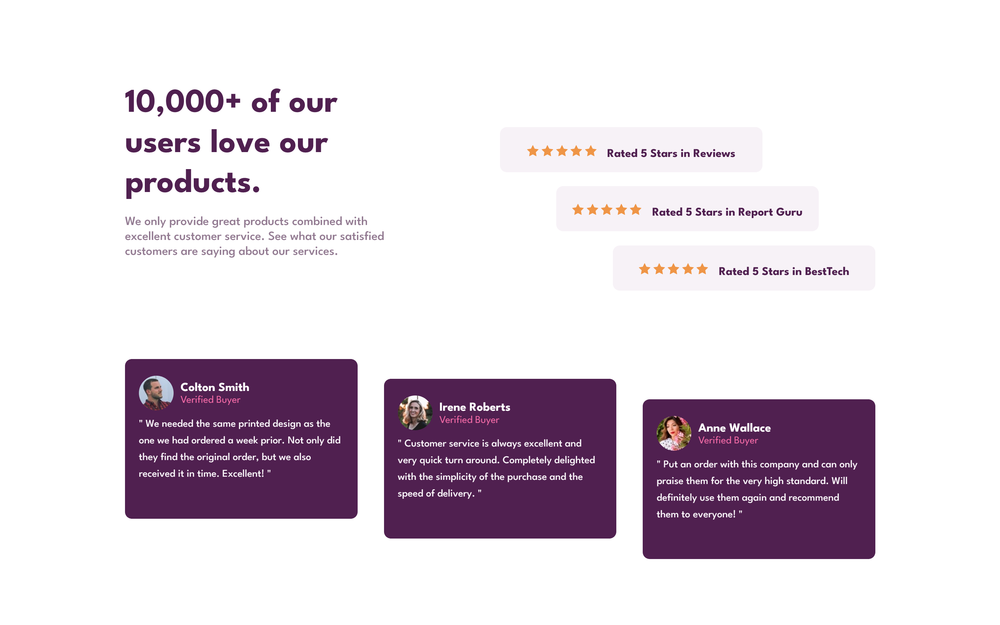

## Table of contents

- [About the project...](#overview)
  - [Screenshot](#screenshot)
  - [Links](#links)
  - [Built with](#built-with)
  - [Continued development](#continued-development)
  - [Author](#author)

### Screenshot
This is a solution to the [Social proof section challenge on Frontend Mentor](https://www.frontendmentor.io/challenges/social-proof-section-6e0qTv_bA). Frontend Mentor challenges help you improve your coding skills by building realistic projects. 

Mobile design
 

Desktop design

### Links

- Solution URL: [Guthub Repository](https://github.com/NitziaCG/Frontend-Mentor-Projects/tree/main/social-proof-section-master)
- Live Site URL: [Site]()

### Built with

- Semantic HTML5 markup
- CSS custom properties
- Flexbox
- CSS Grid
- Mobile-first workflow

### Continued development

I'll continue learning about frontend.

### Useful resources

- [CSS Tricks](https://css-tricks.com/)
- [MDN](https://developer.mozilla.org/en-US/docs/Web/CSS/grid)
- [W3SCHOOLS](https://www.w3schools.com/css/default.asp)

## Author

- Frontend Mentor - [@NitziaCG](https://www.frontendmentor.io/profile/NitziaCG)
- GitHub - [@NitziaCG](https://github.com/NitziaCG/)

