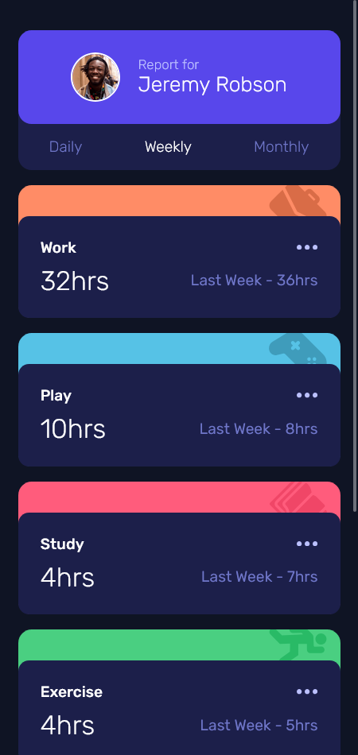
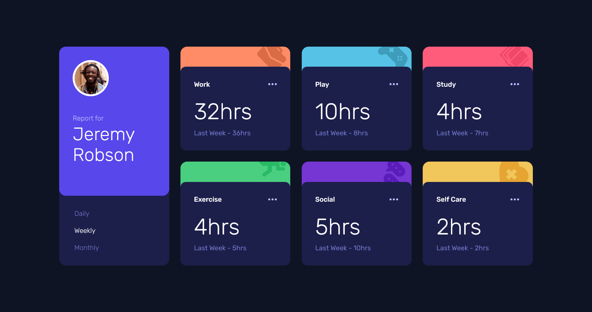

# Frontend Mentor - Time tracking dashboard solution

This is a solution to the [Time tracking dashboard challenge on Frontend Mentor](https://www.frontendmentor.io/challenges/time-tracking-dashboard-UIQ7167Jw). Frontend Mentor challenges help you improve your coding skills by building realistic projects. 

## Table of contents

- [Frontend Mentor - Time tracking dashboard solution](#frontend-mentor---time-tracking-dashboard-solution)
  - [Table of contents](#table-of-contents)
  - [Overview](#overview)
    - [The challenge](#the-challenge)
    - [Screenshot](#screenshot)
    - [Links](#links)
  - [My process](#my-process)
    - [Built with](#built-with)
    - [Continued development](#continued-development)
    - [Useful resources](#useful-resources)
  - [Author](#author)

## Overview

### The challenge

Users should be able to:

- View the optimal layout for the site depending on their device's screen size
- See hover states for all interactive elements on the page
- Switch between viewing Daily, Weekly, and Monthly stats

### Screenshot

<section style="display:flex; gap: 30px; flex-wrap:wrap">
  

    <h3>Mobile screenshot</h3>
    
  

  

    <h3>Desktop screenshot</h3>
    
  

</section>

### Links

- Solution URL: [Github Repository](https://github.com/NitziaCG/Frontend-Mentor-Projects/tree/main/time-tracking-dashboard-main)
- Live Site URL: [https://time-tracking-dashboard-18.netlify.app/](https://time-tracking-dashboard-18.netlify.app/)

## My process

### Built with

- Javascript
- Semantic HTML5 markup
- CSS custom properties
- Flexbox
- CSS Grid
- Mobile-first workflow

### Continued development

I'll continue learning about frontend web development and responsive design patters.

### Useful resources

- [CSS Tricks](https://css-tricks.com/)
- [CSS Reference](https://cssreference.io/)
- [HTML Reference](https://htmlreference.io/)
- [W3SCHOOLS](https://www.w3schools.com/css/default.asp)
- [MDN](https://developer.mozilla.org/en-US/docs/Web/CSS/grid)

## Author

- Frontend Mentor - [@NitziaCG](https://www.frontendmentor.io/profile/NitziaCG)
- GitHub - [@NitziaCG](https://github.com/NitziaCG/)
